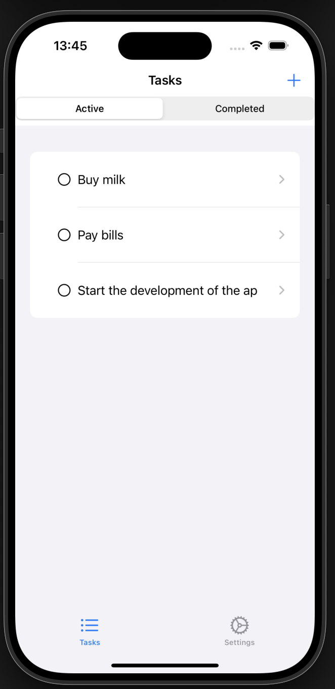
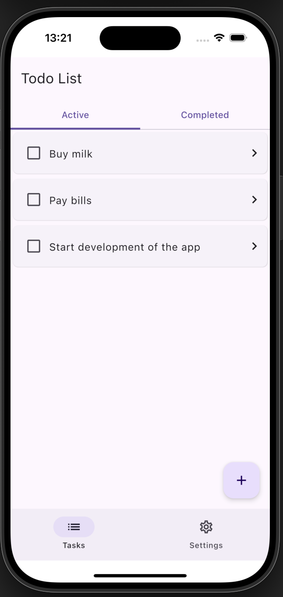
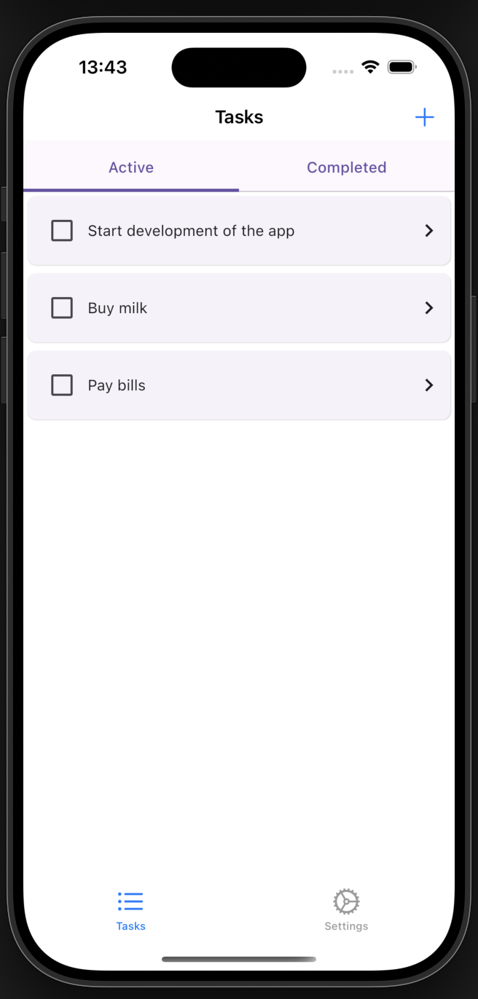

## General Info

A Kotlin Multiplatform demo project targeting Android and iOS.

The business logic (data, domain and viewmodels) is written in Kotlin and shared across all platforms. The UI components are built using Compose Multiplatform and SwiftUI.

 To demonstrate different UI sharing strategies, 3 apps have been developed for the IOS platform. 

| App              | UI                                                                    | 
|------------------|-----------------------------------------------------------------------|
| androidApp       | Compose Multiplatform                                                 |
| iosApp           | SwiftUI                                                               |
| iosAppCMP        | Compose Multiplatform                                                 |
| iosAppSwiftuiCMP | Hybrid: Navigation and controls with SwiftUi, Screen Content with CMP |

## Run project
### Android
To run the application on android device/emulator:
- open project in Android Studio and run imported android run configuration

### iOS
To run the application on iPhone device/simulator:
- Open `ios/iosApp.xcworkspace` in Xcode and run standard configuration
- Or use [Kotlin Multiplatform Mobile plugin](https://plugins.jetbrains.com/plugin/14936-kotlin-multiplatform-mobile) for Android Studio

## Screenshots
### Android

### iOS with SwiftUI

### iOS with CMP

### iOS with SwiftUI and CMP

## Libraries used
- 🧩 [Jetpack Compose](https://developer.android.com/compose); for the Android UI
- 🧩 [SwiftUI](https://developer.apple.com/xcode/swiftui/); for the IOS UI
- 🔶 [Skie](https://skie.touchlab.co) - Swift-friendly API Generator for Kotlin Multiplatform
- 🔷 [kotlinx.coroutines](https://github.com/Kotlin/kotlinx.coroutines) - Library support for Kotlin coroutines with multiplatform support
- 📦 [Kotlinx Serialization](https://github.com/Kotlin/kotlinx.serialization); for content negotiation
- 🕰️ [Kotlinx Datetime](https://github.com/Kotlin/kotlinx-datetime); for datetime
- 🗄 [SQLDelight](https://github.com/cashapp/sqldelight) - for the sqlite database
- ⧉  [Koin](https://insert-koin.io/) - For dependency injection
- 🔶 [Kermit](https://kermit.touchlab.co/) - For logging

## Related Resources

- [Kotlin Multiplatform](https://kotlinlang.org/docs/multiplatform-get-started.html)
- [Get started with Kotlin Multiplatform](https://www.jetbrains.com/help/kotlin-multiplatform-dev/get-started.html)
- [Using Koin in a Kotlin Multiplatform Project](https://johnoreilly.dev/posts/kotlinmultiplatform-koin/)
- [Kotlin Multiplatform samples](https://www.jetbrains.com/help/kotlin-multiplatform-dev/multiplatform-samples.html)
